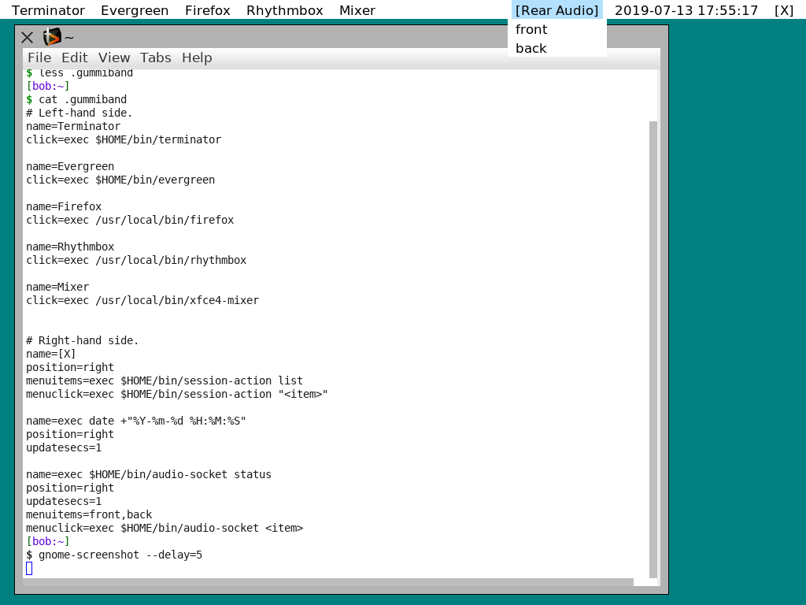

# Gummiband

Gummiband is a program launcher for the X Window System.
It can be configured to show machine status (eg battery %, or the time),
and to provide launch buttons (eg a button to run xterm).
It provides simple drop-down menus (eg a button can show the current wifi
access point, and clicking on the button opens a menu allowing a different
access point to be selected).

Gummiband is based loosely on the 'menu' program by Elliott Hughes.



See the Gummiband man page for more information on how to configure and use
the program.

```man ./gummiband.man```
